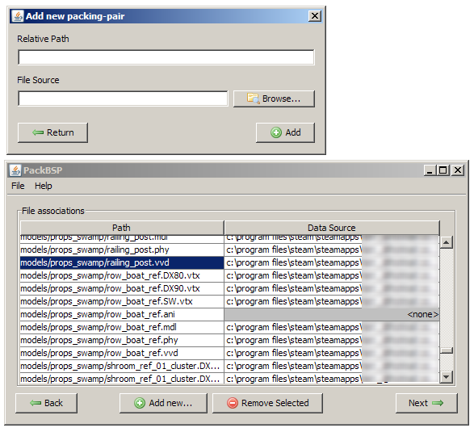
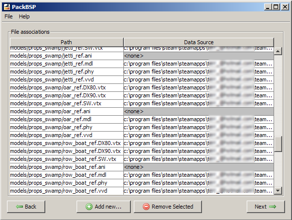

# PackBsp

PackBsp is a program that makes it easy for mappers to embed custom models, textures, and other assets into their maps for games based on Valve's [Source](http://en.wikipedia.org/wiki/Source_%28game_engine%29) engine. It does this by analyzing the map, determining exactly what custom content is being used and what dependencies might exist, and packaging everything into a single BSP file.


 **Warning:** Currently, this tool does not work at all if it cannot detect the old [Source SDK](https://developer.valvesoftware.com/wiki/Source_SDK) at \SteamApps\\[steam\_username\]\Source SDK\ which makes it somewhat unusable with the new [SteamPipe](https://developer.valvesoftware.com/wiki/SteamPipe) update that moved all game folders to \]SteamApps\common\ -- until someone fixes it and releases new binaries, it is suggested you use [bspzip](bspzip.md) or [Pakrat](pakrat.md) instead.



 **Tip:**While no longer under active development, the author welcomes any contributions or fixes, which can be submitted through Github.


For example, your map may have a custom model in it. PackBSP will analyze the model to find all the files and materials it uses, and then analyze those to find gibs or textures, etc. until everything has been explored. It will compare these files against what exists in GCF/NCF files so that only the custom content you really need is included in the map, and can show you when needed content is missing.

## Features

* Works for all Source mods distributed on Steam, such as
  * Half Life 2
  * Half Life 2: Episode One
  * Half Life 2: Episode Two
  * Team Fortress 2
  * Day of Defeat: Source
  * Counter-Strike: Source
* Supports custom content which includes \(but is not limited to\)
  * Models and model-skins
  * Materials and textures
  * Soundscapes and Sounds
  * Particles
  * Skyboxes
* Uses the same data files [Hammer](http://en.wikipedia.org/wiki/Valve_Hammer_Editor) does to find special entities. If you can pick a material or model in Hammer, PackBsp should detect it.

## Support

### Submitting a bug report

To submit a bug report, please go to the Github page and create a new issue, posting a copy of **packbsp\_debug.log**, which can be found in whatever folder you installed PackBsp to.

### Problems and suggested courses of action

**"PackBsp isn't automatically finding  a certain dependency in my map, I keep needing to add it manually.**"

* Please file a bug report, explaining the dependency which is missing and what chain of relationships pulls it in. For example, you may have a prop\_static in your map that has a custom model, that model may have a custom skin, and that skin-material may have a custom texture, but the texture isn't being seen.

**"The 'engine' drop-down is blank or missing entries! I can't find the game I want to run PackBsp for!'"**

* Your Source SDK configuration may be corrupt or incomplete.
* Try briefly starting up the game that is missing.
* Try using the "Refresh SDK Content" option from the Source SDK launcher.
* If you are able to start the Hammer editor for a game, but cannot do the same for PackBsp, please file a bug report.

**"I try to pick the steam directory, and it says that clientregistry.blob is being used by another process!"**

* Steam is probably in the middle of reconfiguring itself somehow, such as with an update. Try again later.
* If trying again later doesn't work, try restarting Steam.
* If problems persist please file a bug report.

**"My `env_projectedtexture` isn't showing up."**

* PackBsp does not support dependencies which may be triggered by the I/O system in Hammer, since it is difficult to analyze and predict what it may do.
* The `env_projectedtexture` entity relies on the I/O system to set the texture that it must use.
* Please inspect your map logic to determine what file\(s\) are needed, and add them manually.

**"I have some map logic which the model that a prop shows, but when I trigger it the new model is missing."**

* PackBsp does not support dependencies which may be triggered by the I/O system in Hammer, since it is difficult to analyze and predict what it may do.
* Please inspect your map logic to determine what file\(s\) are needed, and add them manually.


Source: [http://technofovea.com/blog/projects/packbsp](http://technofovea.com/blog/projects/packbsp)

Reference:

* [http://technofovea.com/blog/](http://technofovea.com/blog/)
* [https://github.com/DHager/packbsp](https://github.com/DHager/packbsp)
* [https://developer.valvesoftware.com/wiki/Packbsp](https://developer.valvesoftware.com/wiki/Packbsp)


